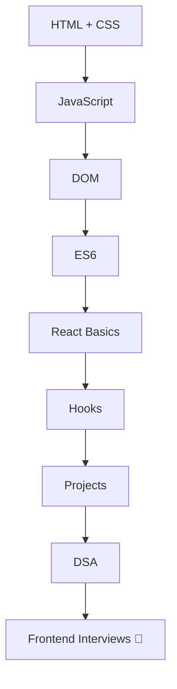

<!-- ========================= -->
<!--        3D HEADER          -->
<!-- ========================= -->

<div align="center">


</div>

---

<!-- ========================= -->
<!--      3D TYPING EFFECT     -->
<!-- ========================= -->

<div align="center">


</div>

---

<!-- ========================= -->
<!--         MATRIX GIF        -->
<!-- ========================= -->

<div align="center">


</div>

---

# 👨‍💻 About This Repository

<div align="center">


</div>

---

# 🌌 FEATURES

<div align="center">

| 🚀 Feature | 💡 Description |
|---|---|
| ⚡ JavaScript | Complete JS Interview Prep |
| ⚛️ React | React Concepts + Hooks |
| 🎯 Viva Questions | College + Placement Viva |
| 💻 Coding Questions | Frontend Coding Rounds |
| 🔥 Projects | Mini + Major Projects |
| 🧠 Theory | Definitions + Explanations |

</div>

---

# 🧠 JAVASCRIPT INTERVIEW TOPICS

<div align="center">


</div>

---

## ⚡ Core JavaScript

```bash
📦 JavaScript
 ┣ 📜 Variables
 ┣ 📜 Scope
 ┣ 📜 Hoisting
 ┣ 📜 Closures
 ┣ 📜 Event Loop
 ┣ 📜 Callback Functions
 ┣ 📜 Promises
 ┣ 📜 Async Await
 ┣ 📜 DOM Manipulation
 ┣ 📜 Array Methods
 ┣ 📜 Objects
 ┗ 📜 ES6 Features
```

---

# ⚛️ REACT INTERVIEW TOPICS

<div align="center">


</div>

```bash
📦 React
 ┣ 📜 JSX
 ┣ 📜 Components
 ┣ 📜 Props
 ┣ 📜 useState
 ┣ 📜 useEffect
 ┣ 📜 Hooks
 ┣ 📜 Context API
 ┣ 📜 React Router
 ┣ 📜 Virtual DOM
 ┣ 📜 SPA
 ┣ 📜 State Management
 ┗ 📜 Lifecycle Methods
```

---

# 🔥 3D DEV SECTION

<div align="center">


</div>

---

# 💻 SAMPLE JAVASCRIPT QUESTION

```javascript
// What is Closure in JavaScript?

function outer(){

    let counter = 0;

    return function inner(){

        counter++;

        console.log(counter);

    }
}

const demo = outer();

demo();
demo();
```

---

# ⚛️ SAMPLE REACT QUESTION

```jsx
import React, { useState } from "react";

function Counter(){

    const [count, setCount] = useState(0);

    return(
        <div>

            <h1>{count}</h1>

            <button onClick={() => setCount(count + 1)}>
                Increment
            </button>

        </div>
    );
}

export default Counter;
```

---

# 📊 GITHUB STATS

<div align="center">


</div>

---

# 🔥 CONTRIBUTION GRAPH

<div align="center">


</div>

---

# 🐍 SNAKE ANIMATION

<div align="center">


</div>

---

# 🌐 CONNECT WITH ME

<div align="center">

<a href="https://github.com/vanshbisht74-arch">

</a>

<a href="https://react.dev/">

</a>

<a href="https://developer.mozilla.org/en-US/docs/Web/JavaScript">

</a>

</div>

---

# 🚀 INTERVIEW PREPARATION ROADMAP

<div align="center">



</div>

---

# 🔥 QUOTE OF THE DAY

<div align="center">


</div>

---

# ⭐ SUPPORT

<div align="center">

### 🌟 STAR THIS REPOSITORY 🌟


</div>

---

<!-- FOOTER -->

<div align="center">


</div>
